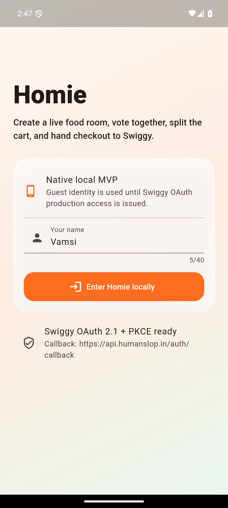
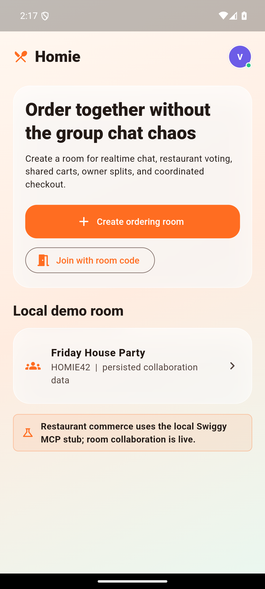
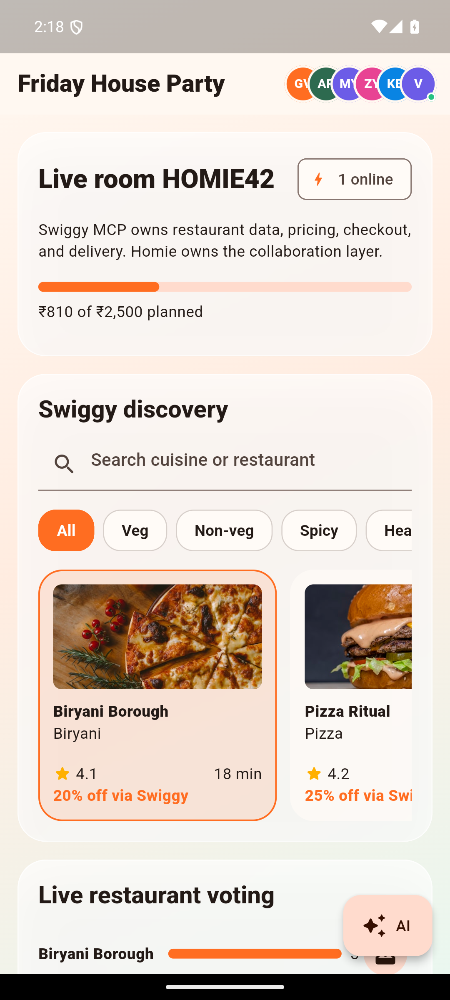
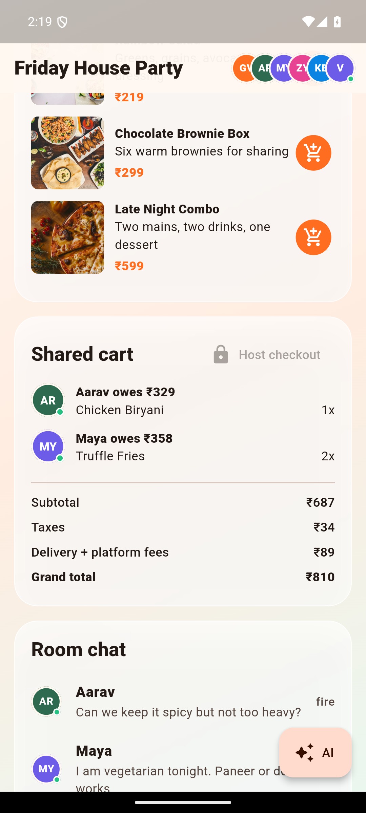
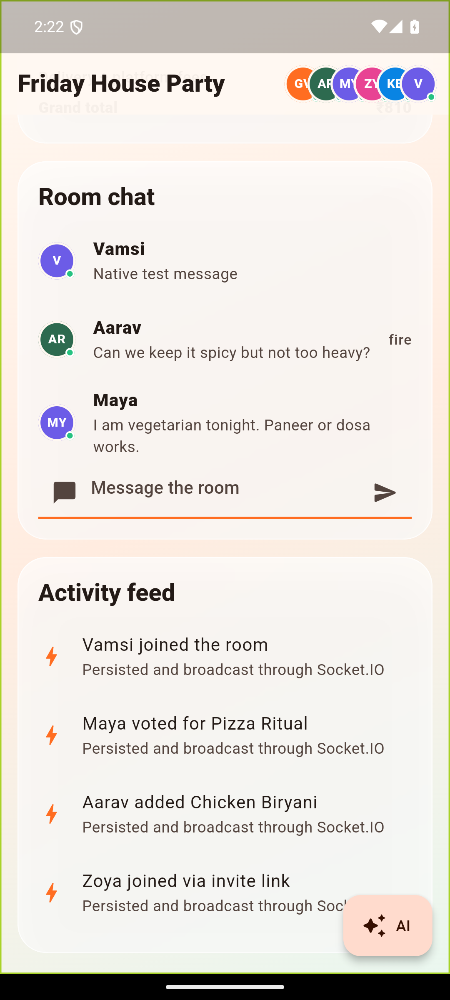

# Homie

Homie is a native collaborative food-ordering MVP built around Swiggy Food MCP. It does not replace Swiggy: Homie owns rooms, presence, voting, chat, cart ownership, and bill splitting; Swiggy remains the commerce and fulfillment boundary.

## What Is Real Locally

- Flutter Android app using Riverpod, GoRouter, HTTP, Socket.IO, and persisted guest identity.
- Express API with validated REST endpoints and acknowledged realtime mutations.
- PostgreSQL persistence for users, rooms, participants, messages, votes, carts, activity, and orders.
- Redis-backed Socket.IO adapter for multi-instance realtime delivery.
- Idempotent operations, canonical server pricing, one vote per user, one restaurant per cart, host-only checkout, and room locking.
- Swiggy MCP adapter with `mock` and `live` modes. Local mode is intentionally mocked until OAuth credentials are issued.

## Native Proof

| Login | Home | Live room |
| --- | --- | --- |
|  |  |  |

| Shared cart | Realtime chat |
| --- | --- |
|  |  |

The chat screenshot was produced on Android and the message was independently verified through `GET /api/rooms/HOMIE42`.

## Run On Android

Prerequisites: Flutter 3.24+, Android Studio/emulator, Node.js 20+, Docker Desktop.

Terminal 1:

```powershell
cd D:\homie
.\scripts\start-local.ps1
```

Terminal 2:

```powershell
cd D:\homie
.\scripts\run-android.ps1
```

The Android emulator reaches the host API at `http://10.0.2.2:4000`. The debug APK is generated at:

```text
apps/mobile/build/app/outputs/flutter-apk/app-debug.apk
```

Stop local services with:

```powershell
.\scripts\stop-local.ps1
```

See [the full local runbook](docs/LOCAL_MVP.md) for manual commands and troubleshooting.

## Verify

```powershell
cd D:\homie\apps\api
npm run lint
npm test

cd D:\homie\apps\mobile
flutter analyze
flutter test
flutter build apk --debug
```

The API integration test creates two guest sessions and covers room join, Socket.IO chat, retry deduplication, authoritative prices, mixed-restaurant rejection, host authorization, and idempotent checkout.

## Repository

```text
apps/
  api/                 Express, Socket.IO, PostgreSQL, Redis, MCP adapter
  mobile/              Native Flutter application
docs/
  API.md               REST and realtime contracts
  ARCHITECTURE.md      Components, data model, and failure handling
  LOCAL_MVP.md         Android runbook
  DEMO_SUBMISSION.md   Builders Club email, questions, and recording script
scripts/
  start-local.ps1
  run-android.ps1
  stop-local.ps1
compose.yaml
```

## Swiggy MCP Boundary

Local default:

```text
SWIGGY_MCP_MODE=mock
```

After Swiggy issues an OAuth token for development/staging:

```text
SWIGGY_MCP_MODE=live
SWIGGY_MCP_FOOD_URL=https://mcp.swiggy.com/food
SWIGGY_TOKEN=<local secret; never commit>
SWIGGY_ADDRESS_ID=<saved address returned by get_addresses>
```

The Flutter app never receives the Swiggy token. Live discovery can then be schema-tested, but live checkout deliberately remains blocked until Swiggy cart variants/add-ons are mapped and `get_food_cart` reconciliation is implemented.

## Data Ownership

Homie persists collaboration metadata only. It does not store passwords, card data, or a second copy of Swiggy transaction payloads. Production OAuth, token encryption, consent/retention controls, and a Swiggy staging order remain required before real commerce traffic.

Official integration notes are in [docs/SWIGGY_MCP_NOTES.md](docs/SWIGGY_MCP_NOTES.md).
