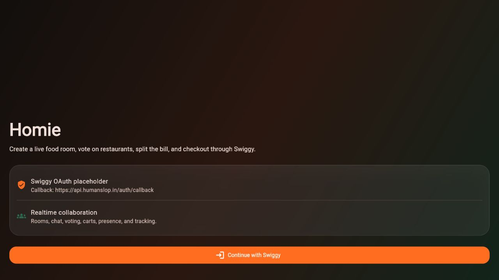
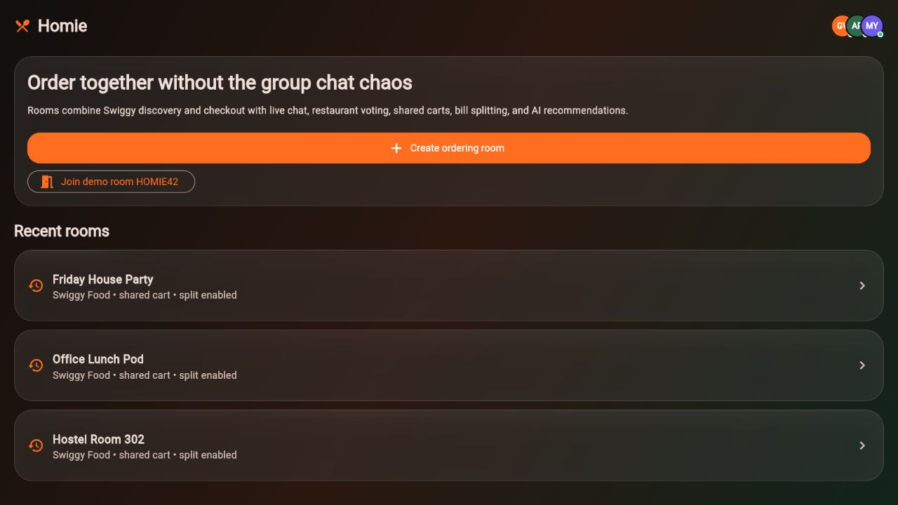
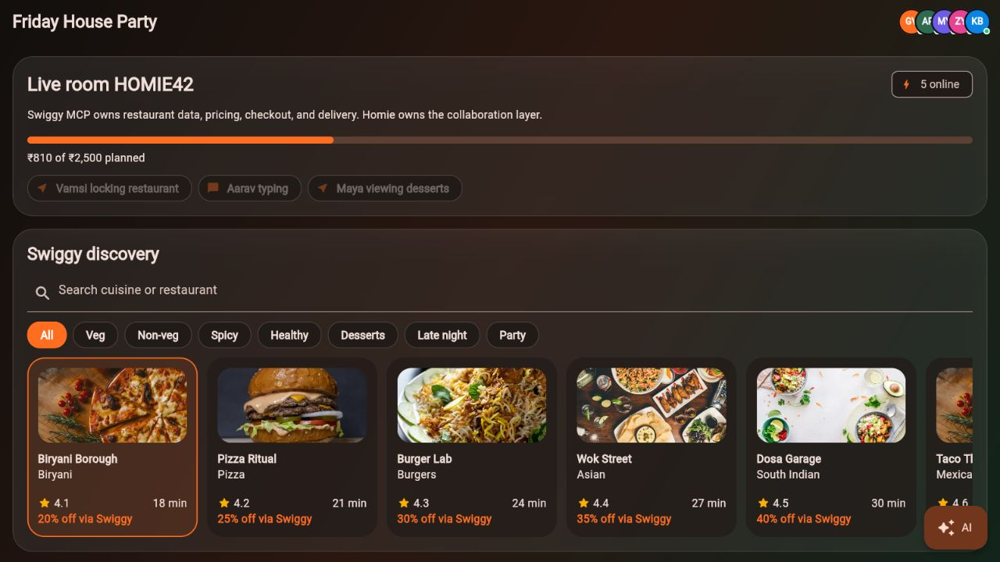
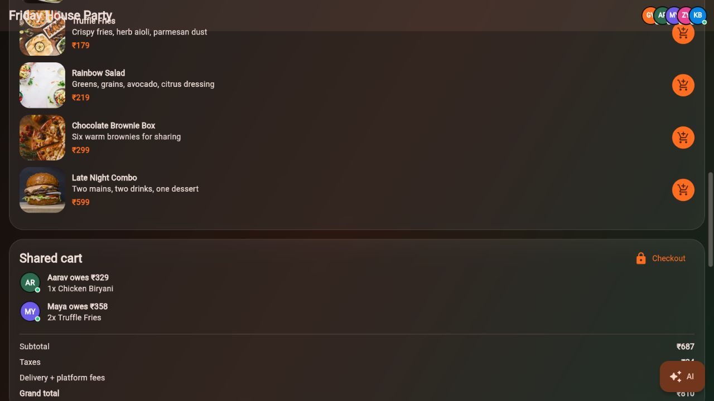
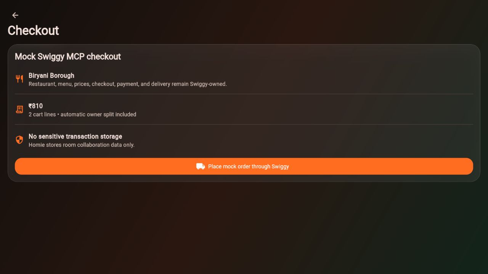
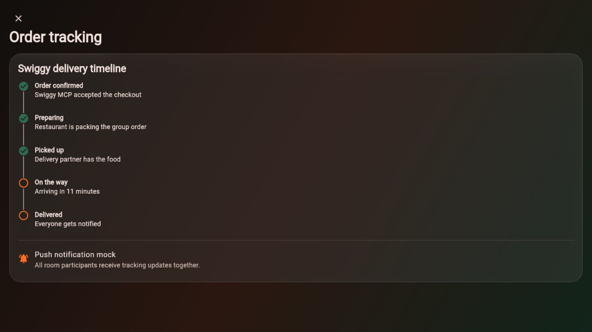
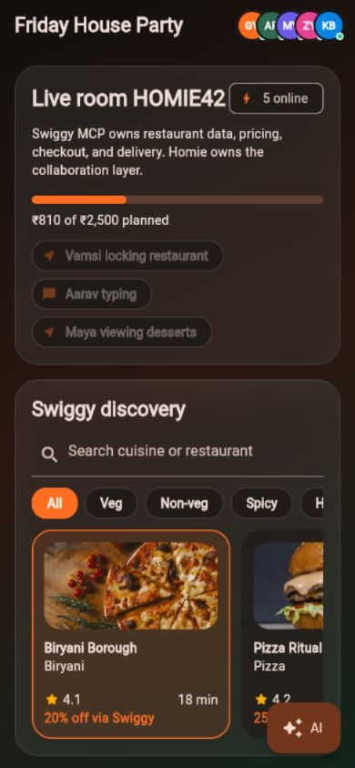
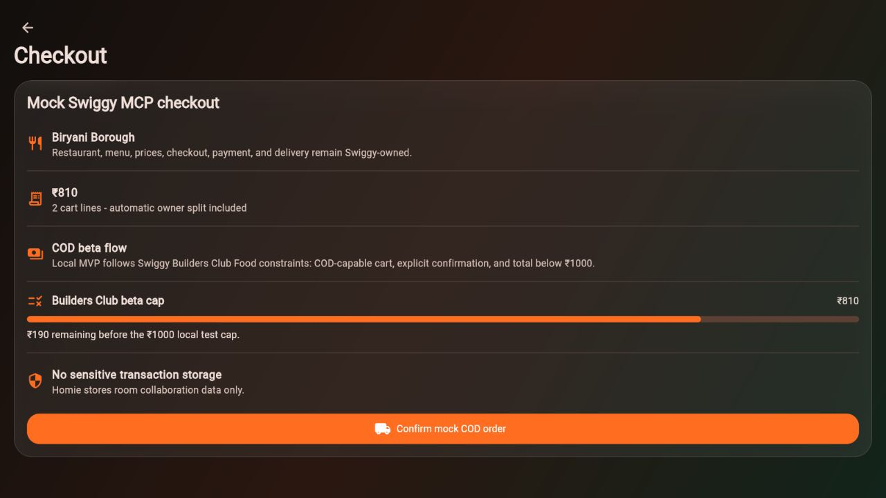

# Homie

Homie is a collaborative food-ordering MVP built on top of a mocked Swiggy MCP layer.

It does not replace Swiggy. Homie provides the collaboration experience around group ordering: rooms, invite links, QR codes, chat, restaurant voting, shared carts, bill splitting, AI suggestions, checkout handoff, and shared order tracking.

## Stack

- Flutter, Material 3, Riverpod, GoRouter
- Node.js, Express, Socket.io
- PostgreSQL and Redis placeholders
- Swiggy OAuth placeholder callback: `https://api.humanslop.in/auth/callback`
- Mocked Swiggy MCP service boundary

## Repository

```text
apps/
  mobile/   Flutter app
  api/      Node/Express/Socket.io API
docs/
  API.md
  ARCHITECTURE.md
  BUILDERS_CLUB.md
  DEPLOYMENT.md
  LOCAL_MVP.md
  SWIGGY_MCP_NOTES.md
```

## Run the Mobile App

```bash
cd apps/mobile
flutter pub get
flutter run
```

For a browser demo:

```bash
cd apps/mobile
flutter run -d chrome
```

## Run the API

```bash
cd apps/api
cp .env.example .env
npm install
npm run dev
```

The API starts on `http://localhost:4000` and exposes MCP-shaped routes under `/api/mcp`.

Quick API checks:

```bash
curl http://localhost:4000/api/health
curl http://localhost:4000/api/mcp/restaurants
```

Run the local Food agent demo:

```bash
cd apps/api
npm run demo:food -- pizza
npm run demo:food -- pizza --confirm
```

See [docs/LOCAL_MVP.md](docs/LOCAL_MVP.md) for the full video runbook.

Swiggy Food MCP-shaped JSON-RPC mock:

```bash
curl -X POST http://localhost:4000/api/mcp/food \
  -H "Content-Type: application/json" \
  -d "{\"jsonrpc\":\"2.0\",\"method\":\"tools/call\",\"params\":{\"name\":\"search_restaurants\",\"arguments\":{\"addressId\":\"addr_home_001\",\"query\":\"pizza\"}},\"id\":1}"
```

## Screenshots

| Login | Home |
| --- | --- |
|  |  |

| Room Discovery | Shared Cart |
| --- | --- |
|  |  |

| Checkout | Tracking |
| --- | --- |
|  |  |

| Mobile Room |
| --- |
|  |

## Fresh Local Working Proof

Captured from `http://127.0.0.1:5100` with the local API running on `http://localhost:4000`.

| Local Login | Local Room |
| --- | --- |
|  |  |

| Local Checkout | Local Tracking |
| --- | --- |
|  |  |

## MVP Features

- Splash, Swiggy OAuth placeholder login, home, create room, invite, room, checkout, tracking
- Room code, invite link, QR code
- Realtime-ready chat and activity feed
- Mock restaurant discovery with search and filters
- Live restaurant voting with progress bars
- Menu cards, item ownership, shared cart, and split totals
- Floating AI assistant with group-aware suggestions
- Mock Swiggy checkout and order tracking timeline
- Presence indicators, typing state, live cursors, recent rooms, favorites-ready structure

## Swiggy MCP Boundary

All Swiggy-facing behavior is isolated behind service interfaces:

- `RestaurantService`
- `MenuService`
- `CartService`
- `OrderService`
- `UserService`
- `McpService`

The mock implementations return realistic demo data today. Replacing them with real Swiggy MCP calls should not require changes to room collaboration, UI state, Socket.io events, or bill splitting logic.

## Data Ownership

Homie stores collaboration data only:

- Rooms
- Participants
- Messages
- Votes
- Cart ownership metadata
- Activity feed

Swiggy remains the source of truth for restaurant discovery, menus, pricing, cart validation, checkout, payments, delivery, and order tracking.

## Swiggy Docs Alignment

The project has been aligned with Swiggy Builders Club docs scraped from `https://mcp.swiggy.com/builders/docs/`.

Important v1 constraints reflected in the backend/docs:

- OAuth 2.1 with PKCE.
- Redirect URIs must be HTTPS exact matches, except localhost for local development.
- Food MCP uses JSON-RPC `tools/call` against the Food server.
- Canonical Food tools include `get_addresses`, `search_restaurants`, `get_restaurant_menu`, `update_food_cart`, `get_food_cart`, `place_food_order`, and `track_food_order`.
- Builders Club Food order placement is beta-limited: cart total must stay below `₹1000`.
- Order placement is non-idempotent, so Homie must never blindly retry `place_food_order`.
- Homie must show user-visible cart confirmation before calling `place_food_order`.

See [docs/SWIGGY_MCP_NOTES.md](docs/SWIGGY_MCP_NOTES.md) for the implementation notes.
