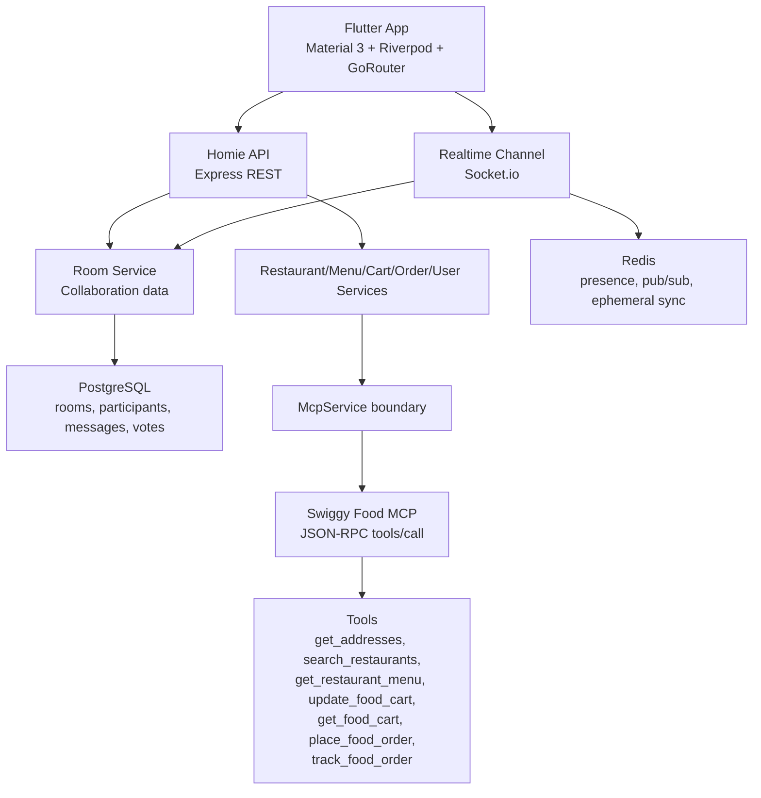

# Architecture



## Frontend Layers

```text
lib/
  core/                 theme and mock data
  domain/
    models/             room, participant, restaurant, menu, cart, order
    services/           service contracts for MCP-facing features
  data/
    mcp/                mock MCP implementation
    repositories/       reserved for remote/local repository implementations
  presentation/
    app.dart            router and app shell
    state/              Riverpod controller
    screens/            splash, login, home, room, checkout, tracking
    widgets/            glass panels, avatars, chips, price helpers
```

## Backend Layers

```text
src/
  config/               env, Postgres, Redis
  data/                 mock data
  routes/               REST API
  services/             use-case services and MCP adapter
  sockets/              Socket.io room events
  server.js             app bootstrap
```

## Production Replacement Plan

1. Keep Homie room APIs unchanged.
2. Replace `MockMcpService` in Flutter only if direct client MCP calls become approved.
3. Replace `apps/api/src/services/McpService.js` with authenticated server-side Swiggy MCP calls.
4. Move `rooms` in-memory data to PostgreSQL tables.
5. Use Redis for presence, typing state, Socket.io adapter, and rate-limit counters.
6. Add OAuth token storage with encryption, rotation, and least-privilege scopes.
7. Add audit logging and PII retention controls before production rollout.
8. Add Food MCP safety guards: exact address confirmation, `₹1000` cart cap, and non-idempotent `place_food_order` check-then-retry.

## Security Notes

- Swiggy OAuth callback is explicitly configured as `https://api.humanslop.in/auth/callback`.
- Swiggy OAuth uses OAuth 2.1 with PKCE; redirect URIs must be HTTPS exact matches, except localhost during local development.
- The backend is the intended MCP caller, preventing Swiggy credentials from being shipped in the app.
- Homie should not store payment details or sensitive transaction payloads.
- Homie should log session/correlation ids, not raw Food MCP request/response bodies.
- MCP access is not resold or exposed to third parties.
- Swiggy attribution should remain visible anywhere MCP data is shown.
