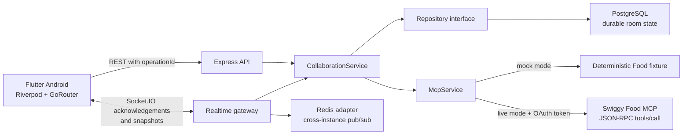

# Architecture



## Flutter Layers

```text
lib/core/                 theme, API environment, startup fixture
lib/domain/models/        collaboration and commerce models
lib/data/network/         HTTP client and Socket.IO client
lib/data/repositories/    remote repository and identity persistence
lib/presentation/state/   Riverpod orchestration and snapshot reconciliation
lib/presentation/screens/ native user flows
```

The fixture keeps the first frame usable. Once the API responds, restaurant/menu and room snapshots are server sourced. Android defaults to `10.0.2.2`; other targets can override `API_BASE_URL` with `--dart-define`.

## Backend Layers

```text
src/routes/               validation and HTTP status mapping
src/sockets/              acknowledged events, presence, broadcasts
src/services/             collaboration use cases and Swiggy boundary
src/data/                 PostgreSQL and memory repositories
src/db/migrations/        idempotent schema and local seed
src/config/               environment, PostgreSQL, Redis adapter
```

## Durable Model

- `users`: local guest identities; replace or link after OAuth.
- `rooms`: host, budget, lifecycle status, and monotonic version.
- `room_participants`: membership.
- `messages`: bounded chat history.
- `restaurant_votes`: one current vote per participant.
- `cart_items`: participant ownership plus canonical menu snapshot.
- `activity_events`: user-readable audit feed.
- `orders`: order reference and room-visible timeline.
- `room_operations`: completed responses keyed by client operation ID.

## Consistency Rules

- Every mutation checks membership and room state.
- Voting again changes a participant's vote instead of inflating totals.
- Cart data is reloaded from `MenuService`; client prices are ignored.
- A room cart contains one restaurant and quantities are bounded to `0..20`.
- Socket failures fall back to HTTP using the same operation ID.
- Checkout requires an open room, host identity, explicit confirmation, a non-empty cart, and total below the local cap.
- Successful checkout stores the order and locks the room.

## Production Gaps

The collaboration plane is locally functional. Live commerce still requires Swiggy-issued OAuth/DCR details, encrypted token storage, refresh/revocation handling, official attribution assets, a staging order, production observability, rate limiting, and agreed retention controls.
